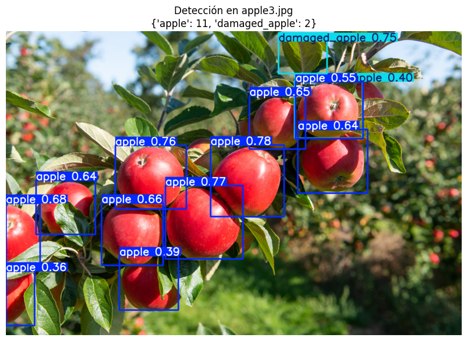

# Apple Yield Estimator (Backend + Frontend)

A full‑stack apple yield estimation platform. The backend runs a YOLOv8s model (ONNX) to detect and count apples from orchard images, and the frontend provides a modern dashboard for estimation, farming records, analytics, and history.



## Features

- Apple detection (healthy vs damaged) with YOLOv8s + ONNX Runtime
- Yield estimation with counts and health index
- FastAPI backend with JWT auth, PostgreSQL storage, analytics, and farming/orchard management
- React + Vite dashboard for uploading images, viewing results, and managing data
- Dockerized backend, frontend, and database via Docker Compose

## Tech Stack

- Backend: FastAPI, SQLAlchemy, PostgreSQL, Pydantic v2, ONNX Runtime
- Frontend: React 18, Vite, Tailwind CSS, React Router, Axios
- Infra: Docker, Docker Compose, Nginx (frontend container)

## Project Structure (high level)

```
yieldEstimator/
├── app/                 # FastAPI backend
├── frontend/            # React frontend
├── docker-compose.yml   # Orchestrates db + backend + frontend
├── Dockerfile.backend   # Backend image
├── Dockerfile.frontend  # Frontend image
├── nginx.frontend.conf  # Nginx config for frontend container
├── requirements.txt     # Backend dependencies
└── uploads/             # Stored images/outputs
```

## Quick Start

### Option A: Docker Compose (recommended)

1. Clone the repo:
   ```bash
   git clone <your-repo-url>
   cd yieldEstimator
   ```

2. Create a `.env` file in the project root:
   ```env
   # Required
   SECRET_KEY=change-me-please-32+chars
   POSTGRES_USER=postgres
   POSTGRES_PASSWORD=postgres
   POSTGRES_DB=yield_estimator

   # Backend DB connection (used by app/db/session.py)
   DB_HOST=db
   DB_PORT=5432

   # Optional
   DEBUG=true
   LOG_LEVEL=INFO
   ```

3. Build and run everything:
   ```bash
   docker compose up --build
   ```

4. Access the app:
   - Frontend: `http://localhost`
   - Backend API: `http://localhost:8000`
   - API docs: `http://localhost:8000/docs`

To stop:
```bash
docker compose down
```

### Option B: Local Development (clone + run services)

1. Clone the repo and create `.env` (same as above, but use `DB_HOST=localhost`).

2. Backend:
   ```bash
   python -m venv venv
   source venv/bin/activate
   pip install -r requirements.txt
   uvicorn app.main:app --reload --host 0.0.0.0 --port 8000
   ```

3. Frontend:
   ```bash
   cd frontend
   npm install
   ```
   Create `frontend/.env`:
   ```env
   VITE_API_URL=http://localhost:8000/api/v1
   ```
   Then run:
   ```bash
   npm run dev
   ```

Frontend dev server runs at `http://localhost:5173` by default.

## API Documentation

- OpenAPI/Swagger UI: `http://localhost:8000/docs`
- ReDoc: `http://localhost:8000/redoc` (only when `DEBUG=true`)

### Core Endpoints

Base prefix: `/api/v1`

Estimator:
- `POST /estimator/estimate` — upload an image and get apple counts

Auth:
- `POST /auth/login`
- `POST /auth/register`

Farming:
- `POST /farming/orchards` — create orchard
- `GET /farming/orchards` — list orchards
- `GET /farming/orchards/{orchard_id}` — get orchard
- `PATCH /farming/orchards/{orchard_id}` — update orchard
- `DELETE /farming/orchards/{orchard_id}` — delete orchard
- `POST /farming/orchard/{orchard_id}/create_tree` — create tree
- `PUT /farming/orchard/{orchard_id}/tree/{tree_id}` — update tree
- `GET /farming/orchard/{orchard_id}/trees` — list trees
- `DELETE /farming/trees/{orchard_id}/{tree_id}` — delete tree
- `DELETE /farming/images/{image_id}` — delete image audit

History:
- `GET /history` — user estimation history

Analytics:
- `GET /analytics` — dashboard stats

Users:
- `GET /users/me` — current user profile
- `PUT /users/me` — update profile

## API Quick Test

Health check:
```bash
curl http://localhost:8000/health
```

Estimator (guest mode):
```bash
curl -X POST "http://localhost:8000/api/v1/estimator/estimate" \
  -H "accept: application/json" \
  -H "Content-Type: multipart/form-data" \
  -F "file=@path/to/your_image.jpg"
```

## Configuration

Backend settings are loaded from `.env` (see `app/core/config.py` and `app/db/session.py`).
Common variables:

- `SECRET_KEY` (required)
- `POSTGRES_USER`, `POSTGRES_PASSWORD`, `POSTGRES_DB`
- `DB_HOST`, `DB_PORT`
- `DEBUG`, `LOG_LEVEL`
- `MODEL_PATH` (default: `app/models/weights/best_model.onnx`)

Frontend:
- `VITE_API_URL` (local dev: `http://localhost:8000/api/v1`)
- Docker build uses `VITE_API_URL=/api/v1` and proxies through Nginx

## Model

- Architecture: YOLOv8s (small)
- Format: ONNX
- Classes: `apple`, `damaged_apple`
- Input size: 640x640
- Weights: `app/models/weights/best_model.onnx`

## Deployment Notes

- Docker Compose is the simplest deployment path for local or single‑node servers.
- The frontend container uses Nginx and proxies `/api/` to the backend container.
- If you deploy behind a reverse proxy (Nginx/Traefik), ensure:
  - `VITE_API_URL` points to the public API base, or use `/api/v1` with a proxy rule.
  - Backend CORS allows your frontend origin.
  - Ports `80` (frontend) and `8000` (backend) are reachable, or re‑map as needed.
- For production:
  - Set `DEBUG=false`
  - Use a strong `SECRET_KEY` (>= 32 chars)
  - Use persistent DB volumes (already in `docker-compose.yml`)

## Tests

```bash
pytest
```

## License

MIT (see `LICENSE`).
